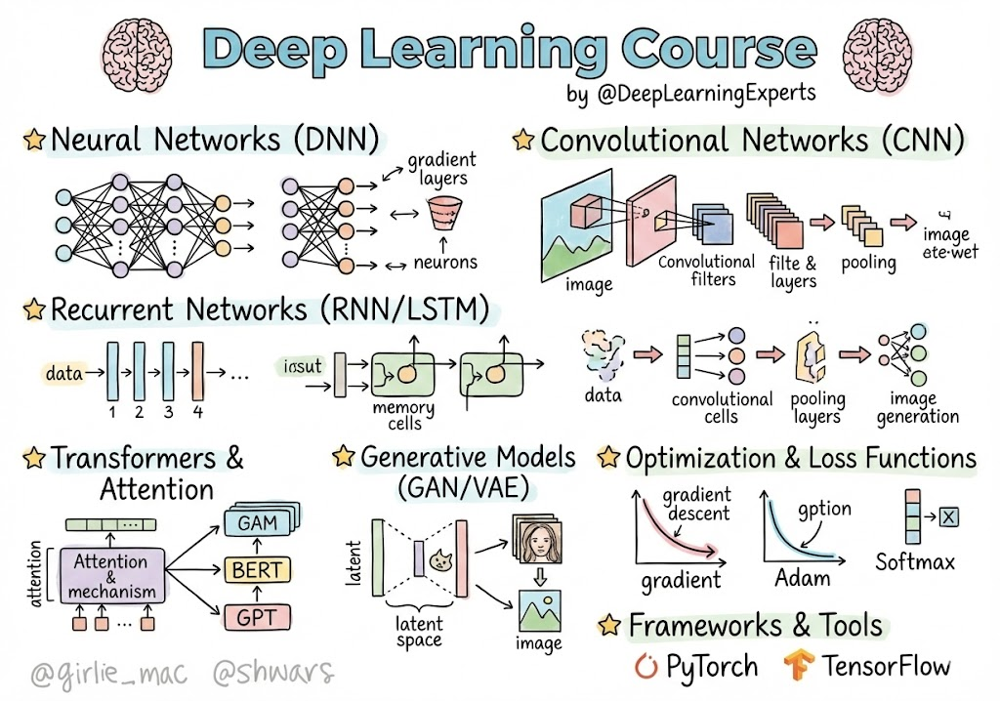

# SI7011 - Deep Learning

Course Repository SI7011 Deep Learning at Universidad EAFIT

| **INSTRUCTOR** | Juan David Martínez Vargas (jdmartinev@eafit.edu.co)|
|----------------|-------------------------------------------------------------------------------------------------------|

## We will learn in this course:

* **Fundamentals of Deep Learning**, including fully connected neural networks, activation functions, loss functions, optimization, and regularization.
* **Convolutional Neural Networks (CNNs)** for representation learning in image data.
* **Representation Learning Models**, including autoencoders and variational autoencoders (VAEs).
* **Generative Models**, with an introduction to Generative Adversarial Networks (GANs).
* **Sequential Models**, such as recurrent neural networks (RNNs) for sequence and time-series data.
* **Attention Mechanisms**, covering the core ideas behind attention and their role in modern neural architectures.
* **Hands-on Implementation**, using **PyTorch** to build and train deep learning models from scratch.

## Evaluation

| Assessment Item                       | Percentage    | 
|---------------------------------------|---------------|
| Laboratory I - Basics                 | 16.25 %       |
| Laboratory II - CNNs and Transfer     | 16.25 %       | 
| Laboratory III - RNNs                 | 16.25 %       | 
| Laboratory IV - Transformers          | 16.25 %       | 
| Integrator Project                    | 16.25 %       | 
| Final Project            | 20 %       | Week 18   |

# Resources:
* Computational resources: I strongly recommend creating (free) accounts on the following platforms:
  - [Google collaborative](https://colab.research.google.com/)
  - [HuggingFace](https://huggingface.co/)
  - [Kaggle](https://www.kaggle.com/)
  - [LightingAI](https://lightning.ai/)
  - [Weights and Biases](https://wandb.ai/site)
  
* Deep Learning books:
  - [Deep Learning](https://www.deeplearningbook.org/)
  - [Dive into Deep Learningas](https://d2l.ai/)
  - [Deep Learning - Foundations and Concepts](https://www.bishopbook.com/)
  - [Deep Learning with Python](https://github.com/fchollet/deep-learning-with-python-notebooks)
 
* Online courses:
  - [Intro to Deep Learning](http://introtodeeplearning.com/)
  - [DeepMind Deep Learning course](https://www.youtube.com/watch?v=7R52wiUgxZI)
 
                                                  

  

